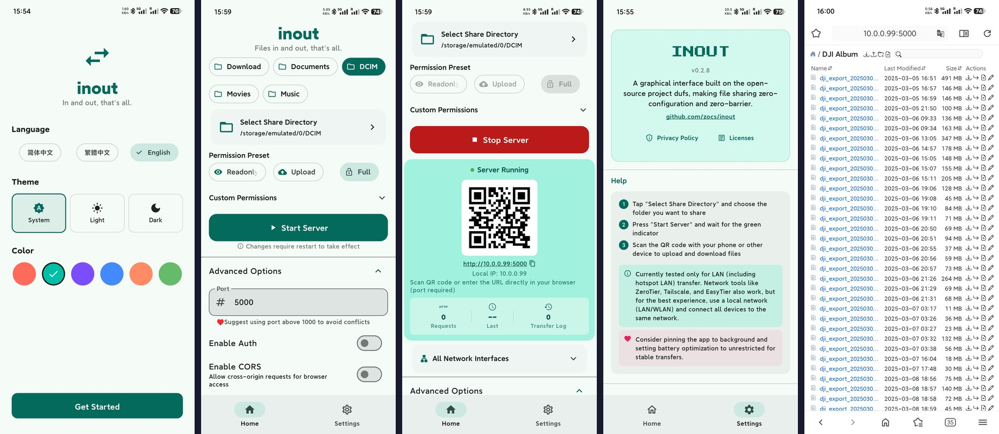

<div align="center">

<h1> inout</h1>

**让文件来去自如。**

[](https://github.com/zocs/inout/releases)
[](LICENSE)
[](https://github.com/zocs/inout/releases)
[](https://flutter.dev)
[](https://github.com/zocs/inout/releases)
[](https://github.com/zocs/inout/releases)
[](https://github.com/zocs/inout/releases)
[](https://github.com/zocs/inout/releases)
[](https://github.com/zocs/inout/actions)
[](https://gitlab.com/fdroid/fdroiddata)

[English](./README.md) · [隐私政策](./PRIVACY.md) · [📥 下载](https://github.com/zocs/inout/releases)

</div>

---

基于开源项目 [dufs](https://github.com/sigoden/dufs) 开发的图形界面版本。**零配置、零门槛**——只需在一台设备上安装运行，其他设备通过浏览器即可访问和传输文件，对方无需安装任何应用。

---

## 📱 截图

[](fastlane/metadata/android/en-US/phoneScreenshots/screenshots_overview.jpg)

---

## ✨ 为什么选择 inout？

> **对方无需安装 APP** — 只需在一台设备上安装 inout，启动服务器，任何人通过浏览器即可访问和传输文件。

| 特性 | |
|:---|:---:|
| 📱 **一端安装就够** | 其他端只需浏览器 |
| ⬆️⬇️ **双向传输** | 上传和下载都行，不只是发送 |
| 🔗 **打开就用** | 扫码或输入地址，对方零门槛 |
| 🔐 **安全可控** | 可选密码认证、CORS 控制 |
| 🔀 **自定义权限** | 细粒度开关：上传、删除、搜索、归档下载 |
| 🎨 **自由配色** | 6 种配色方案 + 深色/浅色模式 |
| 🌐 **多语言** | 简体中文 · 繁體中文 · English |
| 📦 **零依赖** | 自包含，无需额外安装任何东西 |

---

## 💡 使用场景

| 场景 | 操作方式 |
|:---|:---:|
| 🏠 **家庭文件共享** | 手机开热点 → 电脑浏览器访问 → 传输照片/文档 |
| 💼 **办公室临时传输** | 一台电脑启动 → 同事扫码 → 共享项目文件 |
| 🎓 **课堂资料分发** | 老师启动 → 学生扫码 → 下载课件 |
| 🔧 **设备调试日志** | 嵌入式设备 → 手机热点 → 下载日志文件 |
| 📷 **照片批量导出** | 相机/手机启动 → 电脑批量下载 |

---

## 🚀 快速开始

### 下载

| 平台 | 文件 | |
|:---|:---|:---:|
| 🪟 **Windows** | `inout-*-windows-x64-setup.exe`（安装版）或 `.zip`（便携版） | ✅ 已测试 |
| 🤖 **Android** | `inout-*-android-arm64.apk` | ✅ 已测试 |
| 🐧 **Linux x64** | `.AppImage`（零依赖）或 `.deb` | ✅ 已测试 |
| 🐧 **Linux ARM64** | `.AppImage` 或 `.deb`（兼容麒麟/UOS） | ✅ 已测试 |
| 🍎 **macOS** | `inout-*-macos-arm64.zip` | ⚠️ 未实测 |

> 📥 [前往 Releases 下载最新版](https://github.com/zocs/inout/releases)
>
> 🤖 即将上线 [F-Droid](https://f-droid.org/)（审核中）

### 使用步骤

1. 选择要分享的文件夹
2. 点击「启动服务」
3. 其他设备扫描二维码或输入地址
4. 开始传文件 — 就这么简单！

---

## 🌐 网络

> **最简单的方式：** 所有设备连同一个 WiFi 或手机热点。

| 网络环境 | |
|:---|:---:|
| 🏠 **同一 WiFi** | 连上就能传 |
| 📱 **手机热点** | 一台手机开热点，其他设备加入就能用 |
| 🌍 **远程访问** | 支持 ZeroTier、Tailscale、EasyTier 等组网工具 |

> 🔒 **所有传输直接在设备之间进行，不经过任何第三方服务器。**

---

## 🔒 安全提示

> ⚠️ inout 默认绑定所有网卡（`0.0.0.0`）

| 网络环境 | 建议 |
|:---|:---:|
| 家庭 WiFi | ✅ 安全，仅局域网可访问 |
| 公共 WiFi | ⚠️ 建议启用密码认证 |
| 公司网络 | ⚠️ 注意防火墙策略 |
| 公网暴露 | ❌ 不建议，如需远程请使用 VPN |

**最佳实践：**
1. 公共环境启用密码认证
2. 使用完成后及时停止服务
3. 定期检查访问日志

---

## 🔧 故障排查

### Android — 存储权限

**症状：** 无法列出文件，提示"需要开启所有文件访问权限"

**解决：** 设置 → 应用 → inout → 权限 → 允许「所有文件访问」

### 端口被占用

**症状：** 启动失败，提示"端口 XXX 已被占用"

**解决：** 更换端口（建议 8080–9000 范围）或关闭占用进程

### Linux — AppImage 无法启动

**症状：** 双击无反应

**解决：**
```bash
chmod +x inout-*.AppImage
./inout-*.AppImage
```

### macOS — 开发者验证拦截

**症状：** 无法打开，提示"无法验证开发者"

**解决：**
```bash
xattr -d com.apple.quarantine inout.app
```

### Windows — 防火墙拦截

**症状：** 其他设备无法连接

**解决：** 允许 inout 通过 Windows 防火墙（首次启动会自动提示）

---

## ❓ 常见问题

**Q: 对方需要安装 inout 吗？**
A: 不需要！只需一台设备运行 inout，其他设备用浏览器访问即可。

**Q: 可以远程访问吗？**
A: 默认仅局域网。如需远程，配合 ZeroTier / Tailscale / EasyTier 等 VPN 工具。

**Q: 支持 HTTPS 吗？**
A: 当前版本仅 HTTP。HTTPS 功能计划中。

**Q: 最大文件支持多大？**
A: 取决于 dufs 和浏览器，建议单文件 <2GB。

**Q: 可以同时连接多少设备？**
A: 无硬性限制，取决于网络带宽和设备性能。

**Q: 文件会上传到云端吗？**
A: 不会！所有文件存储在本地，传输直接在设备间进行。

---

## 🛠️ 开发

### 环境要求

- Flutter SDK 3.41+
- Windows: VS Build Tools 2022 (C++ workload)
- Android: Android SDK, NDK
- Linux: clang, lld, llvm, libgtk-3-dev
- macOS: Xcode

### 构建

```bash
git clone https://github.com/zocs/inout.git
cd inout
flutter pub get

# 运行（调试）
flutter run -d windows
flutter run -d android

# 构建
flutter build windows --release
flutter build apk --release
```

### 构建脚本

```bash
# Linux (x64 或 ARM64)
bash scripts/build_linux.sh x86_64
bash scripts/build_linux.sh aarch64

# macOS (ARM64)
bash scripts/build_macos.sh aarch64
```

输出：AppImage, deb, rpm, tar.gz（Linux）和 zip（macOS）。

### CI/CD

GitHub Actions 在 tag 推送（`v*`）时自动构建所有平台并创建 release。

### 项目结构

```
lib/
├── main.dart                       # 入口 + 窗口初始化
├── app.dart                        # MaterialApp + 主题
├── l10n/app_localizations.dart     # 三语国际化
├── models/
│   ├── server_config.dart          # 配置模型 + 持久化
│   └── transfer_log.dart           # 传输日志解析
├── pages/
│   ├── home_page.dart              # 主页：目录/权限/启停/二维码
│   ├── settings_page.dart          # 设置：主题/配色/语言
│   ├── setup_wizard_page.dart      # 首次启动向导
│   └── log_page.dart               # 传输日志查看
└── services/
    ├── dufs_service.dart           # dufs 生命周期（平台分发）
    └── dufs_ffi.dart               # FFI 绑定（桌面端）
scripts/
├── build_dufs.sh                   # 跨平台编译 dufs（7 平台）
├── build_linux.sh                  # Linux 打包（AppImage/deb）
├── build_macos.sh                  # macOS 打包
└── dufs-ffi/lib.rs                 # Rust FFI 封装
android/.../DufsForegroundService.kt # Android 原生 Service
installer/inout.nsi                 # Windows NSIS 安装包
```

---

## 🙏 致谢

inout 基于 [dufs](https://github.com/sigoden/dufs) 构建——[sigoden](https://github.com/sigoden) 开发的出色文件服务器。没有 dufs，就没有 inout。感谢让文件分享变得如此简单。

---

## 📄 许可证

[MIT](LICENSE) © 2026 [zocs](https://github.com/zocs)

---

<div align="center">

**inout** — 让文件来去自如。

</div>
